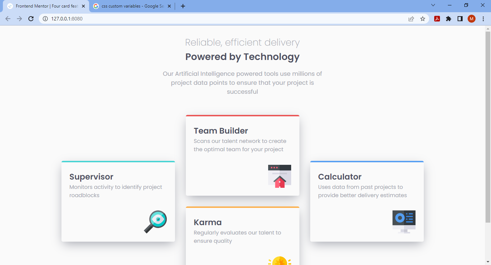

# Frontend Mentor - Four card feature section solution

This is a solution to the [Four card feature section challenge on Frontend Mentor](https://www.frontendmentor.io/challenges/four-card-feature-section-weK1eFYK). Frontend Mentor challenges help you improve your coding skills by building realistic projects.

## Table of contents

- [Overview](#overview)
  - [The challenge](#the-challenge)
  - [Screenshot](#screenshot)
  - [Links](#links)
- [My process](#my-process)
  - [Built with](#built-with)
  - [What I learned](#what-i-learned)
  - [Continued development](#continued-development)
  - [Useful resources](#useful-resources)
- [Author](#author)
- [Acknowledgments](#acknowledgments)

## Overview

### The challenge

Users should be able to:

- View the optimal layout for the site depending on their device's screen size

### Screenshot

Screenshot of the mobile view:


Screenshot of the desktop view:


### Links

- Solution URL: [https://github.com/ShaibMO/frontend-mentor-challenge-2](https://github.com/ShaibMO/frontend-mentor-challenge-2)
- Live Site URL: [https://frontend-mentor-challenge-2-git-main-shaibmo.vercel.app/](https://frontend-mentor-challenge-2-git-main-shaibmo.vercel.app/)

## My process

### Built with

- Semantic HTML5 markup
- CSS custom properties
- Flexbox
- CSS Grid
- Mobile-first workflow

### What I learned

Creating CSS variables like this one below is a great way of avoiding repetition and longer codes.

```css
:root {
  --bg-color: hsl(23%, 45%, 67%);
}
.box {
  background-color: var(--bg-color);
}
```

Also, it makes project maintenance easier as wrong values only need to be correct once to be corrected throughout the code.

### Continued development

With the time I spent on this project, my rustiness with CSS Grid Layout Module was evident. Thus, I would love to see and work on more advanced projects that would help me enhance my Grid layout skills.

### Useful resources

- [Example resource 1](https://developer.mozilla.org/en-US/docs/Web/CSS/Using_CSS_custom_properties) - This is an amazing article from MDN which helped me finally understand CSS custom variables. I'd recommend it to anyone still learning this concept.

## Author

- Frontend Mentor - [@ShaibMO](https://www.frontendmentor.io/profile/ShaibMO)
- Twitter - [@shaib_mosesO](https://www.twitter.com/shaib_mosesO)

## Acknowledgments

My warmest appreciation goes to Andrea Pang, from whose solution and comment on Frontend Mentor I learnt about the implementation of CSS custom variables in making cleaner style sheets.
